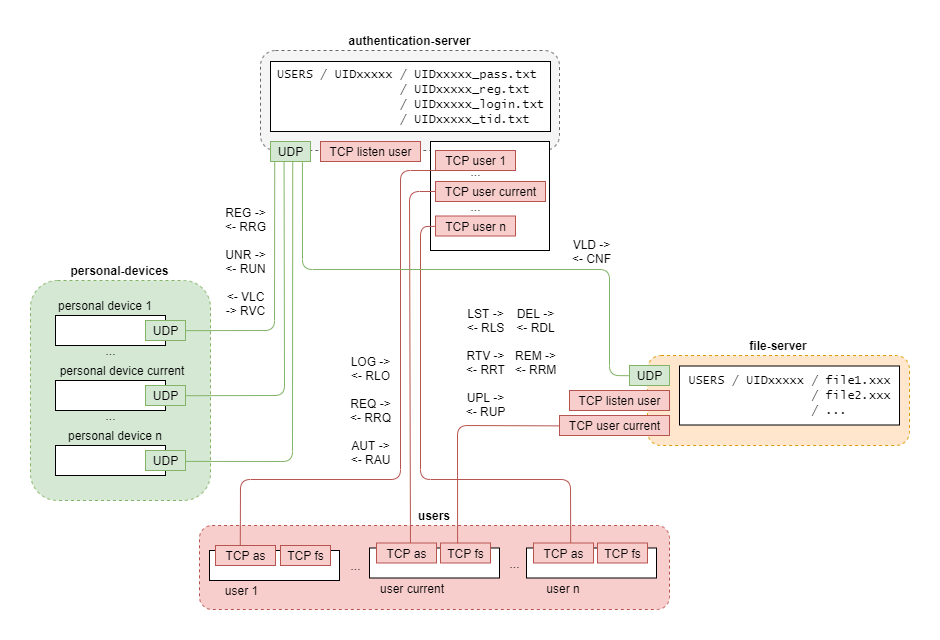

# Redes de Computadores / Computer Networking

## Languages: C

### Project - Two Factor Authentication System

- Goal: develop a two factor authentication system to allow a user to transfer files to and from a server
- [Project Statement](./two-factor-authentication/project-statement.pdf)
- [Solution](./two-factor-authentication/)