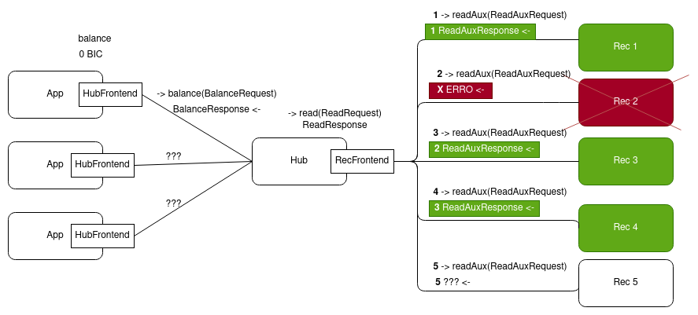

# Relatório do projeto *Bicloin*

Sistemas Distribuídos 2020-2021, segundo semestre

## Autores

**Grupo A52**


| Número | Nome              | Utilizador                                   | Correio eletrónico                  |
| -------|-------------------|----------------------------------------------| ------------------------------------|
| 92438  | Catarina Carreiro | <https://git.rnl.tecnico.ulisboa.pt/ist192438> | <mailto:c.cativo.carreiro@tecnico.ulisboa.pt>   |
| 92440 | Cristiano Clemente       | <https://git.rnl.tecnico.ulisboa.pt/ist192440> | <mailto:cristiano.clemente@tecnico.ulisboa.pt>     |

 


## Melhorias da primeira parte

- No Rec, [foi adicionada sincronização de variáveis partilhadas](https://git.rnl.tecnico.ulisboa.pt/SD-20-21-2/A52-Bicloin/commit/272ec6806dcdf51b74b6e2eea1ccb11726ae4f91). Nomeadamente, o HashMap que mapeia as chaves para os seus registos respetivos passou a ser concorrente.
- No Hub, foram criadas as classes  [```User```](https://git.rnl.tecnico.ulisboa.pt/SD-20-21-2/A52-Bicloin/src/branch/main/hub/src/main/java/pt/tecnico/bicloin/hub/User.java) e [```Station```](https://git.rnl.tecnico.ulisboa.pt/SD-20-21-2/A52-Bicloin/src/branch/main/hub/src/main/java/pt/tecnico/bicloin/hub/Station.java), de forma a abstrair e melhorar o código.
- No Hub, [foi adicionada sincronização nos métodos perigosos](https://git.rnl.tecnico.ulisboa.pt/SD-20-21-2/A52-Bicloin/commit/272ec6806dcdf51b74b6e2eea1ccb11726ae4f91). Nomeadamente, passou a existir isolamento de sequências de leituras e escritas nos mesmos registos para que apenas um procedimento possa estar a aceder a registos de um mesmo utilizador e de uma mesma estação.
- Na App, foi criada a classe [```Coordenadas```](https://git.rnl.tecnico.ulisboa.pt/SD-20-21-2/A52-Bicloin/src/branch/main/app/src/main/java/pt/tecnico/bicloin/app/Coordinates.java), de forma a abstrair e melhorar o código
- Os ficheiros ```pom``` foram corrigidos - já é possível correr o rec, o hub, e a app com ```mvn exec:java```


## Modelo de faltas

* São toleradas falhas por paragem, mas não são toleradas faltas bizantinas.
* O sistema é assíncrono
* A comunicação pode omitir mensagens
* No máximo, existe uma minoria de gestores de réplica do ```rec``` em falha em simultâneo
* As falhas das réplicas do ```rec``` são transientes e não definitivas
* Por simplificação, assumimos que o ```hub``` não falha durante o processamento de procedimentos remotos, ou seja, não deixa procedimentos acabados


## Solução



- De forma a tolerar ```f```  faltas o grau de replicação ```N``` tem de ser ```N>=2f+1```.
- Quando é preciso fazer uma leitura/escrita de um valor mutável, o ```RecFrontend``` faz um pedido a ```N``` ```rec```s diferentes mas apenas precisa de esperar pela resposta de uma maioria, ou seja, mesmo que não receba resposta de ```f``` ```rec```s a operação continuará a ter sucesso.
- Desta forma é possível garantir que mesmo que no limite falhem ```f``` ```rec```s o funcionamento do resto do programa não será afetado.


## Protocolo de replicação

No protocolo de replicação:

- É utilizada uma abordagem de replicação ativa, com uma implementação simples do protocolo de registo distríbuido coerente.
- Assumindo que podem falhar até ```f``` ```recs``` é preciso ter ```N``` réplicas tal que ```N>=2f+1```.
- Dadas ```N``` réplicas, o quórum terá que satisfazer ```|Q| > N/2``` para qualquer leitura ou escritura.
- Cada réplica guarda ```name```, o nome associado ao registo, ```val```, que é o valor do registo, e ```seq```que é o número de sequência do registo. 


A nível da troca de mensagens:

- Nas leituras, o cliente:

  - Envia um pedido de read() para todas as réplicas
  - Aguarda por respostas de um quórum
  - Retorna maxVal, ou seja, o valor que recebeu associado à maior sequência

- Nas leituras, a réplica:

  - Recebe o pedido de read() e responde com <val, seq>

    

- Nas escritas, o cliente:

  - Executa uma leitura para obter a maxSeq
  - Envia write(name, val, maxSeq + 1) a todas as réplicas, em que maxSeq + 1 será a nova sequência
  - Espera por respostas de um quórum
  - Retorna

- Nas escritas, a réplica:

  - Ao receber write(name, val, newSeq), se newSeq > seq, então atualiza o val, e a seq,  e responde

    

## Medições de desempenho


| Programa     | Número de Reads | Número de Writes | Rácio Read/Writes | Tempo de Reads (ms) | Tempo de Writes (ms) | Tempo Médio por Read (ms) | Tempo Médio por Write (ms) |
|--------------|-----------------|------------------|-------------------|---------------------|----------------------|---------------------------|----------------------------|
| comandos.txt | 29              | 13               | 2.23              | 350                 | 171                  | 12                        | 13.16                      |

- Dado o rácio de reads para writes (o número de reads é mais do que o dobro do número de writes), uma otimização passaria por melhorar o tempo médio por read, porque, aliás, o tempo médio por read e o tempo médio por write estão muito próximos um do outro.


## Opções de implementação

- Não implementámos nenhuma otimização.

- Não introduzimos nenhuma melhoria.

## Notas finais

- Não implementámos a versão completa do protocolo porque, apesar do hub ser multi-threaded, só há um hub e duas apps não conseguem escrever no mesmo registo simultaneamente logo a versão simples do protocolo é suficiente.

- Dadas termos verificado que numa utilização comum da aplicação as leituras são bastante mais frequentes do que as escritas, uma otimização possível passaria por otimizar as leituras em detrimento das escritas, definindo quóruns de leitura (RT) diferentes dos quóruns de escrita (WT) de tal forma que RT << WT salvaguardando que RT+WT>N para garantir a interseção leitura-escrita e que WT>N/2 para garantir a interseção escrita-escrita.

- É importante relembrar que o nosso grupo apenas tinha 2 elementos ao contrário dos 3 que estavam previstos.

